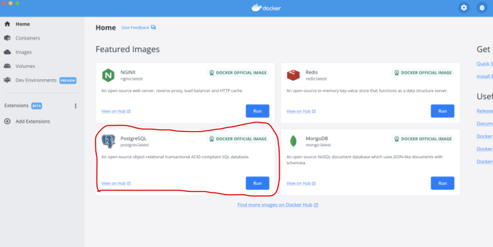
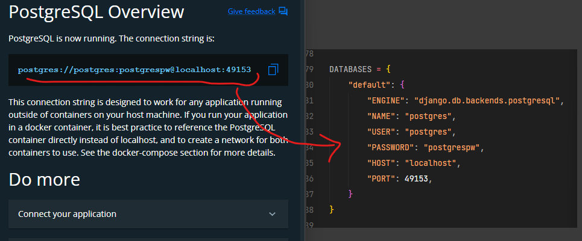
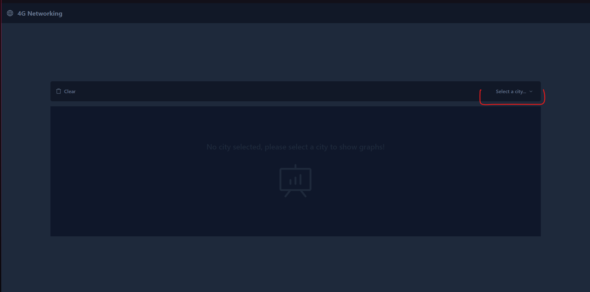
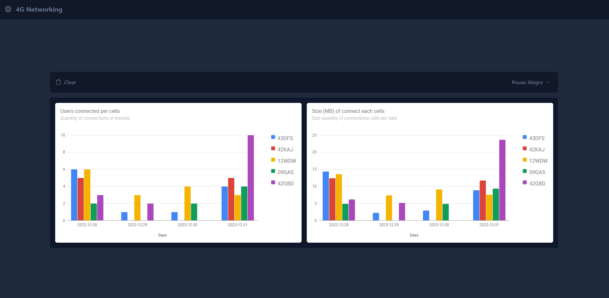
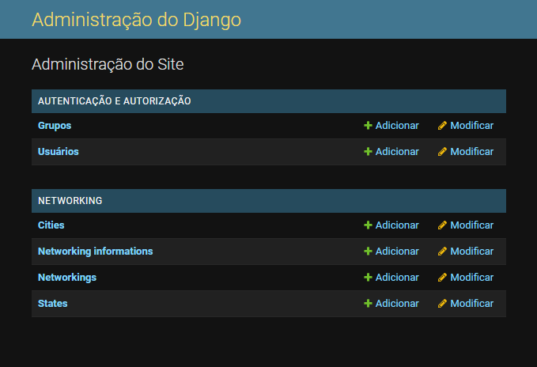

# Challenge 4G


## Backend

### Installation

This project require Python 3.11.1 to run stable, docker.

```
> $ cd backend 
> $ pip install -r requirements.txt
```

After install dependencies, you must configure database connection. The project use Postgres SQL to save information. With your docker opened, run official postgres docker image to create your database 

<div align="center">
  
</div>

<br>
Verify if database configurations match with your configurations. 
<div align="center">
  
</div>

### Run

To run project, run commands to update database and up server:
```
> $ python src/manage.py makemigrations
> $ python src/manage.py migrate
> $ python src/manage.py runserver
```

### About routes/endpoints

- networking/cities
  - This endpoint return all cities on system

- networking/\<str:city\>
  - This endpoint connect on random cell (random cell to simulate a networking) and return connection information 

- info/\<str:city\>
  - This endpoint return all connections until endpoint called by city


## Frontend

### Installation

The frontend needs of the nodeJS on version 18.12.0. To install dependencies you can choose package manager, in this project was use ***yarn***, but it's not mandatory.

```
> # install dependencies
> $ yarn install

> # run project
> $ yarn dev
```

### About frontend

When you open project on web, you must choose any city to show graph.
<div align="center">
  
</div>
<br>
<div align="center">
  
</div>

## Creation data for graph

To create any data to show on graph, you only make a request to backend on endpoint `networking/\<str:city\>`, but before you needs register a city and cell, for this action on terminal run `python src/manage.py createsuperuser` and access `http://localhost:8000/admin` to register city and cells. After this, is only make a request to `http://localhost:8000/networking/\<str:city\>` to create a data to show on graph.

- OBS
  > **Networking** is the cells and enodebs <br>
  > **NetworkingInformations** is data to plot on graphs

<br>
<div align="center">
  
</div>